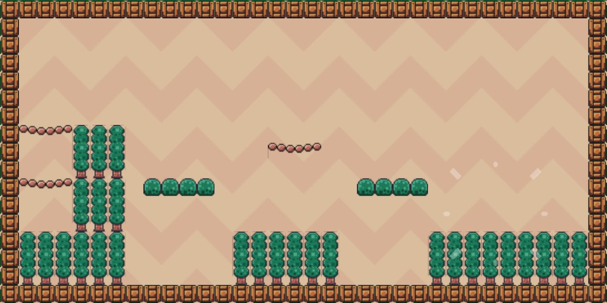

# Platformer Game

This is a small platformer game that has 5 levels. Players can run and jump onto the platforms, eat fruits and escape from the saw trap. They need to go to the checkpoint door to unlock the next level


## 1. Project structure

Overall structure(source codes are all *.dart files under lib/ folder):


IDE: Android studio

platform: Web, Android, IOS


Yaml dependencies:

```yaml
dependencies:
  flutter:
    sdk: flutter

  # The following adds the Cupertino Icons font to your application.
  # Use with the CupertinoIcons class for iOS style icons.
  cupertino_icons: ^1.0.8
  flame: ^1.29.0
  flame_tiled: ^3.0.3
  flame_audio: ^2.11.6
```


## 2. Module Component

- `main.dart`: program entry, create the GameWidget instance
- `GamePlay.dart`: an instance of FlameGame, which is a required parameter to GameWidget. We set up the joystick for mobile, camera here and it is also used to handle level switching
- `Item/`
  - `Checkpoint.dart`: the door of each level which marks the end of the level
  - `fruit.dart`: the fruit prop of certain stages
  - `Platform.dart`: the block and platform for the player to stand
  - `saw.dart`: the trap of certain stages
- `Level/`:
  - `background_tile.dart`: paint the background of the game
  - `level.dart`: extend the world instance, used to load items, players and background of the game
- `Overlay/`:
  - `jump_button.dart`: create the jump button for users to interact on mobile along with the joystick
- `Player`/: 
  - `player.dart`: the movement and collision behaviour of the player we control

- `Util/`
  - `Utils.dart`: contain util functions
  - `custom_hitbox.dart`: configuration of hitbox in items and players

## 3. Key features

### 1. Map Design

We use the library of `flame_tiled` to import maps created from Tiled Editor. We use function `TiledComponent.load` to retrieve layer objects from tile map as examples below:

```dart
level = await TiledComponent.load('$levelName.tmx', Vector2.all(16));
final backgroundLayer = level.tileMap.getLayer('Background');
final spawnPointsLayer = level.tileMap.getLayer<ObjectGroup>('Spawnpoints');
final collisionsLayer = level.tileMap.getLayer<ObjectGroup>('Collisions');
```

 We use Tiled Editor to edit the level map:


 

### 2. Display animation for item

The game can display animations for player, fruit, saw trap items. This attributes to the use of `SpriteAnimation.fromFrameData`, which can generate animation from a sequence of frame images as following:


An example of frame image is as following:


### 3. Collision Detection

We add the mixin of `CollisionCallbacks` to the player class and makes it handle different objects such as saw trap, fruit and checkpoint door in the hook of `onCollisionStart` and add hitbox inside these items:





collsion effect:

- fruit:

  

  

- saw trap(jump back to the starting point):

  

  

  

- Checkpoint(Go to the next level):

  

  

In addition, we also create classes for those platforms and blocks so that they can block the player from moving vertically and horrizontally when colliding against them.


### 4. Movement Control

We add `KeyboardHandler` mixin to the `Player` class so that it can receive keystrokes from the keyboard. However, this only ensures the movement control on web platform. To support mobile platform, we create joystick and jump button in the code:


Mobile joystick and jump button:


### 5. Gravity

In addition, we apply gravity to the player so that the player can fall while jumping or walking off a platform:


This is done by calling `_applyGravity` in `update` method in Player class to update the player's position: 


### 6.  Audio player

Every time when the player jumps, collects the fruit or get hit by the saw trap, there will be a sound effect. This is done by calling the `FlameAudio.play` in those movement trigger methods(Example as following):


## 4. Set up & run

1. After unzip the folder, open "Challenge3" as the root folder in Android studio
2. Type `flutter pub get` to download all dependencies
3. Choose the device to be either web(Chrome) or your mobile emulator, then press the run button to run the project


## 5. Physical device demo

https://drive.google.com/file/d/1N0s5eTRBU9jpCCA2_85Fm91ILEHXU7yp/view?usp=drive_link

## 6. Github link

https://github.com/junior-stack/COMP5450-Challenge3.git